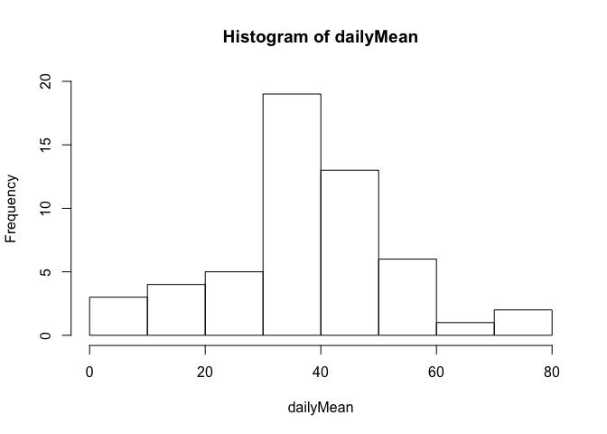
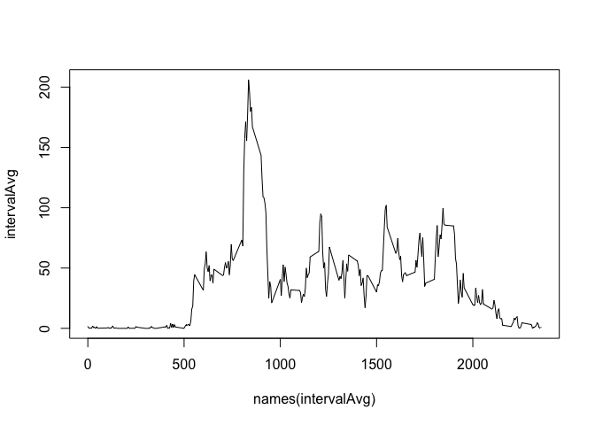
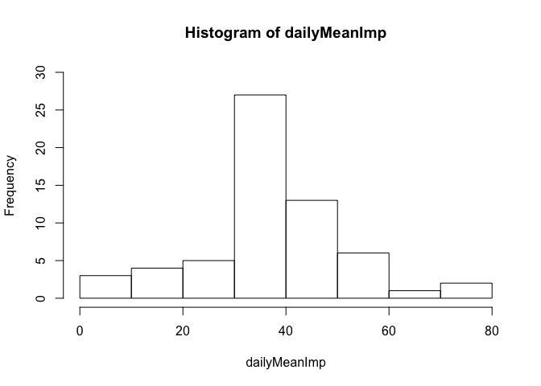
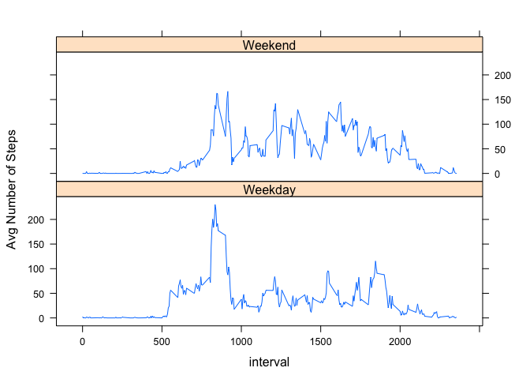

# Reproducible Research: Peer Assessment 1


## Loading and preprocessing the data

```r
data <- read.csv(unz("activity.zip", "activity.csv"))
```

## What is mean total number of steps taken per day?

```r
dailyMean <- tapply(data$steps, FUN = mean, INDEX = as.factor(data$date), na.rm = T);
hist(dailyMean, ylim = c(0, 20));
```

 

```r
paste("Mean:", mean(dailyMean, na.rm = T));
```

```
## [1] "Mean: 37.3825995807128"
```

```r
paste("Median:", median(dailyMean, na.rm = T));
```

```
## [1] "Median: 37.3784722222222"
```

## What is the average daily activity pattern?

```r
intervalAvg <- tapply(data$steps, FUN = mean, INDEX = as.factor(data$interval), na.rm = T);
plot(names(intervalAvg), intervalAvg, type = "l");
```

 

```r
paste("Max Interval:", names(which.max(intervalAvg)));
```

```
## [1] "Max Interval: 835"
```


## Imputing missing values

```r
paste("Number of NAs", nrow(data[is.na(data$steps), ]));
```

```
## [1] "Number of NAs 2304"
```

```r
## Impute missing values using the intervalAvg
imputeData <- data;
for (intervalName in names(intervalAvg)) {
    avg <- intervalAvg[names(intervalAvg) == intervalName];
    imputeData[imputeData$interval == intervalName, ]$steps <- ifelse(
        is.na(imputeData[imputeData$interval == intervalName, ]$steps),
        avg,
        imputeData[imputeData$interval == intervalName, ]$steps
    );
}

dailyMeanImp <- tapply(imputeData$steps, FUN = mean, INDEX = as.factor(imputeData$date), na.rm = T);
hist(dailyMeanImp, ylim = c(0, 30));
```

 

```r
paste("Mean:", mean(dailyMeanImp, na.rm = T));
```

```
## [1] "Mean: 37.3825995807128"
```

```r
paste("Median:", median(dailyMeanImp, na.rm = T));
```

```
## [1] "Median: 37.3825995807128"
```
The mean and median do change with the imputed data.

## Are there differences in activity patterns between weekdays and weekends?

```r
imputeData$date <- as.Date(imputeData$date)
## Is it a weekday or weekend?
imputeData$dayEnd <- as.factor(
    ifelse(
        weekdays(imputeData$date) %in% c("Monday", "Tuesday", "Wednesday", "Thursday", "Friday"),
        "Weekday",
        "Weekend"
    )
);
intervalAvgDayEnd <- tapply(imputeData$steps, FUN = mean, INDEX = list(as.factor(imputeData$interval), imputeData$dayEnd));
library("reshape2");
plotVals <- melt(intervalAvgDayEnd);
names(plotVals) <- c("interval", "dayEnd", "mean");
library("lattice")
xyplot(mean ~ interval| dayEnd, type = "l", data = plotVals, ylab = "Avg Number of Steps", layout=c(1,2));
```

 
